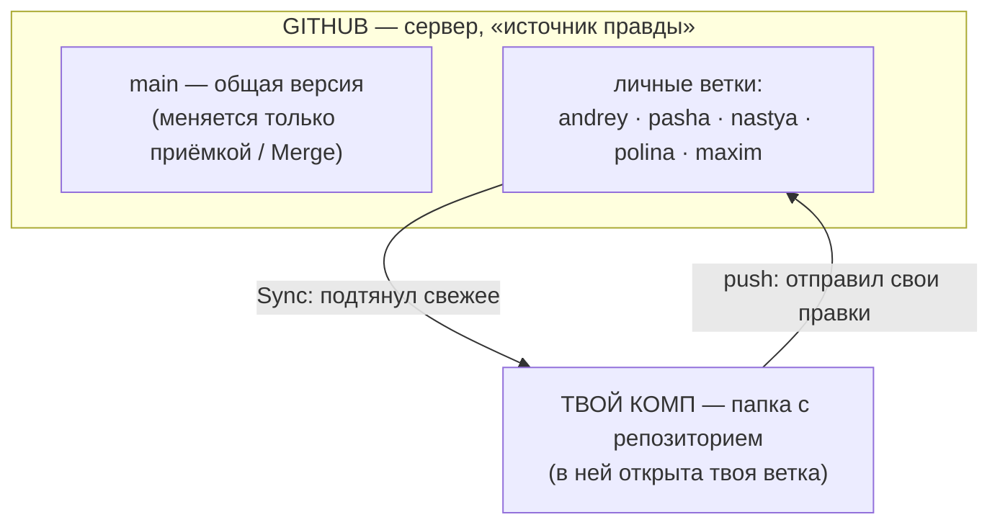
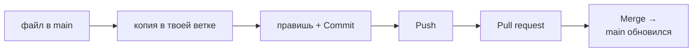
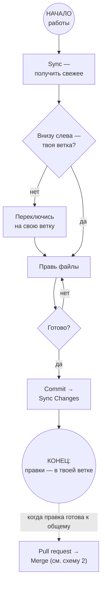

# Как мы работаем с Git — инструкция для команды

> Коротко: **в `main` напрямую не пишем.** Каждый работает в своей персональной ветке;
> изменения попадают в `main` только через Pull request → Merge.

Персональные ветки (уже созданы) названы по именам участников латиницей:
`andrey` · `pasha` · `nastya` · `polina` · `maxim` — каждый работает в своей.

## 1. Общая картина

- **main** — общая версия, её не трогают руками.
- **Твоя ветка** — личная «корзина» для правок.
- **Папка на компе — одна.** Ветка — переключатель: какая версия сейчас открыта.

## 2. Путь одной правки

Пока правка в ветке — `main` НЕ меняется. После Merge её видят все (после их Sync).

## 3. Что делать по шагам

**Один раз (2 минуты):**

1. Открой папку репозитория в VS Code.
2. Внизу слева нажми **Sync** (🔄).
3. Клик по имени ветки → выбери `origin/своё-имя` → **Checkout**.
   ✅ Проверка: внизу слева стоит твоё имя, а не `main`.

**Каждый рабочий день:**

4. **Sync** — получил свежие правки остальных.
5. Работай — правь файлы (они пишутся в твою ветку).
6. Закончил: панель **Source Control** → короткое описание → **Commit** → **Sync Changes**.

**Когда правка готова к общему использованию:**

7. GitHub → **Pull requests → New** → base: `main`, compare: твоя ветка → **Create**.
8. **Merge** — приёмку в `main` делает ответственный (или автор правки).
9. Снова **Sync** — и работай дальше.

## 4. Блок-схема дня

## 5. Правила

1. Никогда не пиши в `main` — только в свою ветку.
2. Перед отправкой проверь: внизу слева — твоя ветка.
3. Отправляй часто (раз в день) — меньше конфликтов.
4. Кнопка **Update branch** — не страшная, жми смело.
5. Непонятно / красное / конфликт — не чини вслепую: позови коллегу.
6. Синхронизироваться «каждый час» не обязательно — Sync ничего не стирает; но чем реже, тем больше потом конфликтов.

## 6. Если что-то пошло не так

**Правил файлы, думая что в своей ветке, а сам — в `main`:**

- Правки ещё **не отправлены** (Push не нажимал) → просто переключись на свою ветку — правки «поедут» с тобой.
- Уже **закоммитил локально** → позови коллегу (или агента): перенесём коммит в твою ветку, `main` не тронем.
- Уже **отправил в `main`** → не паникуй и ничего не удаляй: на GitHub открой свой коммит → **Revert** (или позови — откатим), потом повтори правки в своей ветке.

## 7. Как просить ИИ-агента (Copilot и другие)

- Говори прямо: **«залей в мою ветку»** или «залей в `pasha`».
- Агент **никогда не должен** пушить в `main`. Если предлагает — это ошибка, скажи: «нельзя в main, только в мою ветку».
- Если агент спрашивает «в какую ветку?» — назови свою.
- Правила для агентов лежат в `.github/copilot-instructions.md` — они читают их сами.

## 8. Частые вопросы

- **Правка сразу попала в `main`?** — Нет: сначала только в твою ветку; в `main` — после Merge.
- **Что видят остальные, пока я работаю?** — Ничего. Увидят после Merge и своего Sync.
- **Можно навредить `main` из своей ветки?** — Нет. Хоть удали все файлы у себя — в `main` ничего не изменится.
- **А если коллега правил тот же файл?** — Merge предупредит о конфликте: это нормально, решается за пару минут.
- **Обязательно синхронизироваться?** — Нет. Но Sync ничего не стирает, а редкая синхронизация = больше конфликтов потом.

---

*Дата: 22.09.2026. PDF-версия со схемами — в общем чате команды.*
